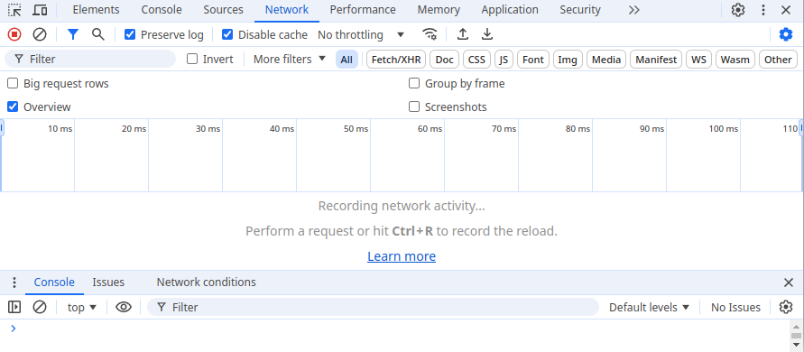
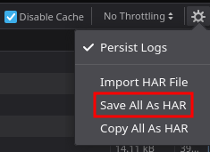

# Diagnose video playback issues with DevTools

## Why this tutorial?

Invidious or more specifically Video.JS (the library for the video player) can't give you a proper error for the famous message "The media could not be loaded, either because the server or network failed or because the format is not supported.".

Here is how to find the real error and fix it.

## Requirements

This tutorial only works on the desktop version of Firefox and Chromium based browsers (Chrome, Brave, Opera, Vivaldi, Edge and so on).

## Open DevTools and get familiar with the Network tab

1. Press the F12 key on your keyboard. Or Ctrl + Shift + E at the same time if F12 did not work.
2. By default, this will automatically show you the "Elements" category. Click instead on the "Network" tab.
3. You should see a window like this:  
   
   
4. You may not see any requests listed yet or already some active requests, follow the second part for the troubleshooting part.

## Troubleshoot failed requests

1. Keep the Devtools open.
2. On Chromium based browser, drag the "Status" column to make it wide as much as possible.  
       
   On Firefox, drag the "Transferred" column to make it wide as much as possible.  
   
3. Refresh the page (F5 key) and load your video again if refreshing did not play the video again.
4. Every line under Name, Status, Type, Size OR "Status", "Method", "File" is a "Web Request". More info about what it is [here](https://web.archive.org/web/20241207173530/https://sourcedefense.com/glossary/web-request/).
   
   
5. Look for lines that are in red color. For each one, read the type of request with their cause and possible solutions:

### A) Request with name "videoplayback" and with Status 403 OR NS_BINDING_ABORTED

#### Diagnostic

On Chromium based browser, you will immediately see the status code. You can read "Cause and solutions".

On Firefox, click on the line of the request. Then look for "Status" on the new section opened, if it's 403 then read the "Cause and solutions". If it is not then read the other requests types.

#### Cause and solutions

Please read the dedicated page here: [Videoplayback URLs that returns 403 HTTP errors](./youtube-errors-explained.md#videoplayback-urls-that-returns-403-http-errors)

### B) Request with name "videoplayback" or "latest_version" or some random number/letters with "?local=true" and with Status ERR_NAME_NOT_RESOLVED OR NS_ERROR_UNKNOWN_HOST or CORS failed or NS_ERROR_CONNECTION_REFUSED or ERR_CONNECTION_REFUSED or any error starting with NS_ERROR_CONNECTION or ERR_CONNECTION

    
   
    
    
    

#### Cause

Your browser can't resolve an external resource because the domain/hostname doesn't exist or no server is not listening to the port or the port is restricted.

#### Solutions

- Make sure you have correctly followed the post install [in the installation guide](./installation.md).
- Look for possible solutions in the GitHub issues of Invidious by searching for the error message: https://github.com/iv-org/invidious/issues
- If you are trying the new Invidious companion, make sure that public_url and base_url is correctly configured. Double check!

### C) Request with Status 500

    

#### Cause

The Invidious backend returned an error.

#### Diagnostic

Click on the line of the request then go "Preview" tab and visualize the error.

If it's an HTML response then you will see the error directly, if it's JSON then you might have to scroll or find more precisely the error.

#### Solution

Keep note of the error found using DevTools and also look at the logs of Invidious for any errors. Once done, search in the Invidious issues for possible solutions: https://github.com/iv-org/invidious/issues

### D) I see red lines for "videoplayback" but my error type is not listed

#### Diagnostic

Click on the line of the request then check the Status Code or "Status" in Firefox.

#### Solution

- Look for possible solutions in the GitHub issues of Invidious by searching for the error message: https://github.com/iv-org/invidious/issues
- If you did not really find any solution then you might have hit a unknown bug, if that's the case then please open a bug report at https://github.com/iv-org/invidious/issues/new/choose.   
  Make sure to include as much details as possible.

### E) I don't see any red lines

#### Diagnostic

Go to the Console tab and check the errors. If you see errors like: `The media could not be loaded, either because the server or network failed or because the format is not supported.`, then check the solutions:

#### Solution(s)

- If you are on Microsoft Edge or on a non-standard Firefox installation, you might be missing some codecs: https://github.com/iv-org/invidious/issues/3756
- Look for possible solutions in the GitHub issues of Invidious by searching for the error message: https://github.com/iv-org/invidious/issues
- If you did not really find any solution then you might have hit a unknown bug, if that's the case then please open a bug report at https://github.com/iv-org/invidious/issues/new/choose.   
  Make sure to include as much details as possible.

## Export the requests done for further analysis by Invidious developers

??? warning "Before sending the file to anyone!"

    Do not send this file to any random person. The file contains personal info and sensible info.  
    Only share it to the people that you trust, for example to Invidious developers.  
    Or remove yourself any personal info by editing the file.  

Use the following button on Chromium based browser:

Or on Firefox:

## Advanced troubleshooting

For Chromium based browsers, I recommend following this tutorial which explains how to use the Network tab: https://developer.chrome.com/docs/devtools/overview#network

And there is a video too: https://youtu.be/t1c5tNPpXjs?t=206

For Firefox, there is a dedicated guide here: https://firefox-source-docs.mozilla.org/devtools-user/network_monitor/index.html